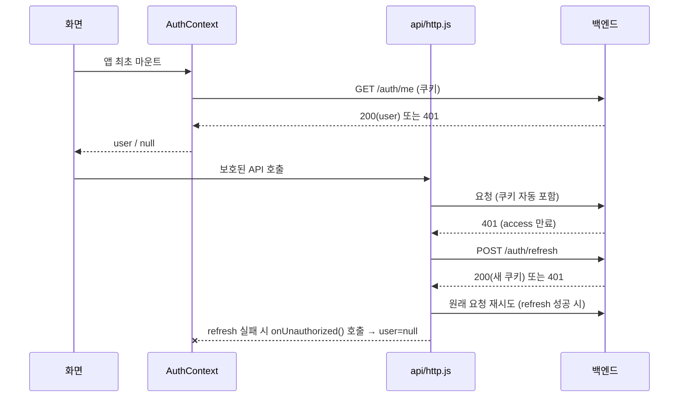

# 🥔 감자중고나라 — Client

중고거래 + 실시간 경매 플랫폼 프론트엔드 (React 19 + Vite SPA)

## 기술 스택

- React 19
- react-router 8 (Data Router)
- Vite 8
- lucide-react (아이콘)
- ESLint 10

## 시작하기

```bash
npm install
cp .env.example .env   # 필요하면 값 수정
npm run dev
```

백엔드 없이 화면 구조만 확인하려면 `.env`의 `VITE_DEV_AUTO_LOGIN` 관련 값은 지워도 되지만,
로그인이 필요한 페이지(마이페이지 등)는 실제 백엔드가 떠 있어야 정상 동작합니다.

### 환경 변수 (`.env`)

| 변수 | 설명 | 기본값 |
|---|---|---|
| `VITE_API_BASE_URL` | API 베이스 경로. 상대경로로 두면 vite proxy가 처리 | `/api` |
| `VITE_API_TARGET` | dev 서버 프록시가 실제로 연결할 백엔드 주소 | `http://localhost:8080` |
| `VITE_DEV_MOCK_LOGIN` | `true`면 API 호출 없이 곧바로 mock 유저로 로그인 시작 (dev 빌드 전용) | - |
| `VITE_DEV_MOCK_USER_ID` | mock 유저 id | `1` |
| `VITE_DEV_MOCK_NICKNAME` | mock 유저 닉네임 | `테스트유저` |
| `VITE_DEV_MOCK_ROLE` | mock 유저 권한 (`USER` / `ADMIN`) | `USER` |

## 폴더 구조

```
src/
├─ api/            # 서버 통신 (fetch wrapper + auth API)
│  ├─ http.js       # 공용 fetch wrapper (쿠키 포함, 401→refresh 자동 재시도)
│  └─ authApi.js    # login/logout/me/refresh 엔드포인트 정의
├─ components/
│  ├─ layout/       # Header, Footer, MainLayout, SideMenu
│  ├─ button/       # Button, ChangeMode(Dropdown)
│  ├─ input/        # Input, SearchBar, DropDown, RatingStar
│  └─ list/         # DataTable, ListItem, Pagination, SortTabs
├─ constants/
│  └─ userRole.js   # USER_ROLE — 실제 users.role DB 값 (USER/ADMIN)
├─ context/
│  └─ AuthContext.jsx  # 로그인 상태 전역 관리 (토큰이 아니라 user 정보만 보관)
├─ pages/           # 라우트별 화면 (대부분 스텁, 아래 TODO 참고)
├─ router/
│  ├─ router.jsx    # 라우트 정의
│  ├─ Auth.jsx      # 라우트 가드 (GUEST/LOGIN/ADMIN/PUBLIC 처리)
│  └─ role.js       # constRole — 라우트가 요구하는 접근 레벨
└─ features/        # 기획 메모(README)만 있음, pages와 중복 → 정리 필요
```

## 라우팅 & 접근 권한

| Path | 접근 레벨 | 컴포넌트 | 비고 |
|---|---|---|---|
| `/` | PUBLIC | `Home` | 로그인 여부 상관없이 보이는 공용 홈 화면 |
| `/login` | GUEST | `Login` | 로그인 폼. 로그인 상태면 `/`로 리다이렉트 |
| `/signup` | GUEST | `Signup` | |
| `/search` | LOGIN | `Search` | 중고거래 목록 |
| `/auction` | LOGIN | `Auction` | 경매장 |
| `/products/:id` | LOGIN | `ProductDetail` | |
| `/products/register` | LOGIN | `ProductRegister` | |
| `/chat` | LOGIN | `Chat` | |
| `/payment/:id` | LOGIN | `Payment` | |
| `/mypage/:id` | LOGIN | `MyPage` (index) / `EditProfilePage` (`/edit`) | |
| `/admin` | ADMIN | `Admin` | `users.role === "ADMIN"` 필요 |
| `*` | - | `NotFoundPage` | |

접근 레벨 4종 (`router/role.js`의 `constRole`):
- **GUEST** : 비로그인 상태에서만 접근 가능 (로그인 상태면 `/`로)
- **LOGIN** : 로그인한 유저만 접근 가능 (아니면 `/`로)
- **ADMIN** : 관리자만 접근 가능 (아니면 `/`로)
- **PUBLIC** : 로그인 여부 상관없이 누구나 접근 가능

> ⚠️ `role.js`의 `constRole`(이 라우트가 요구하는 접근 레벨)과
> `constants/userRole.js`의 `USER_ROLE`(실제 DB `users.role` 값)은
> 이름은 비슷하지만 다른 개념이라 일부러 파일을 분리했습니다.
> (`constRole.ADMIN === "admin"` 소문자 / `USER_ROLE.ADMIN === "ADMIN"` 대문자 — 서로 다른 값)

## 인증 아키텍처 (쿠키 기반 JWT)

- Access(15분)/Refresh(7일) 토큰 둘 다 **HttpOnly 쿠키**로 서버가 발급 → 프론트 JS는 토큰 값을 아예 읽을 수 없음
- `AuthContext`는 토큰이 아니라 **로그인된 유저 정보(user)만 메모리에 보관**, 새로고침하면 `/auth/me`로 세션 복원
- `api/http.js`는 모든 API 요청에 적용되는 공용 fetch wrapper
  - `credentials: "include"` 고정 (쿠키 자동 전송)
  - 401 받으면 `/auth/refresh` 자동 호출 → 성공 시 원요청 재시도 (한 번만, 무한루프 방지)
  - refresh까지 실패하면 `AuthContext`에 등록해둔 콜백으로 로그아웃 처리



### 개발 편의: 상시 로그인 (mock, API 호출 없음)

`.env`에 아래를 넣으면, 백엔드에 요청을 아예 보내지 않고 앱이 뜨자마자 로그인된 상태로 시작합니다.

```
VITE_DEV_MOCK_LOGIN=true
VITE_DEV_MOCK_USER_ID=1
VITE_DEV_MOCK_NICKNAME=테스트유저
VITE_DEV_MOCK_ROLE=ADMIN
```

백엔드/Redis가 안 떠 있어도 프론트 화면 작업이 가능하다는 게 목적이라, 이 상태는 진짜 세션이
아닙니다. 로그아웃 버튼을 눌러도 서버에 요청이 안 가고 그냥 다시 mock 유저로 돌아옵니다 — 실제
로그인/로그아웃/refresh 흐름을 테스트하려면 이 옵션을 꺼야 합니다. `import.meta.env.DEV` 체크가
있어서 `npm run build` 결과물에는 이 값이 켜져 있어도 절대 반영되지 않습니다.

## 주요 컴포넌트

- **`Header`** : 관리자 / 로그인 / 비로그인 × 메인 / 서브 화면 조합으로 5가지 상태 분기 (와이어프레임 기준)
- **`MainLayout`** : `Header` + `<Outlet/>` + `Footer`
- **`Auth`** (`router/Auth.jsx`) : 라우트 가드. `children` 감싸기 방식과 부모 라우트(`<Outlet/>`) 방식 둘 다 지원

## 알려진 TODO / 미완성 항목

- `pages/*` 대부분 스텁 상태 (제목/설명 텍스트만 있고 실제 UI는 미구현)
- 헤더 하트(찜)/벨(알림) 아이콘 → 연결할 페이지가 아직 없어서 클릭해도 동작 없음
- 관리자 네비게이션(회원관리/경매관리/중고거래 관리) → `/admin` 하위 라우트가 아직 없어서 전부 `/admin`으로 임시 연결
- 헤더 햄버거 메뉴(카테고리) → 클릭하면 "준비중" placeholder만 뜸
- `src/features/*` 와 `src/pages/*` 내용이 중복 (기획 메모만 있음) → 추후 하나로 정리 필요
- `src/pages/Adnim` (오타로 생긴 폴더, 사용 안 함) → 삭제 가능
- `src/text.jsx` : 스크래치용으로 보이는 임시 파일 → 정리 필요

## 스크립트

| 명령어 | 설명 |
|---|---|
| `npm run dev` | 개발 서버 실행 |
| `npm run build` | 프로덕션 빌드 |
| `npm run lint` | ESLint 검사 |
| `npm run preview` | 빌드 결과 미리보기 |
