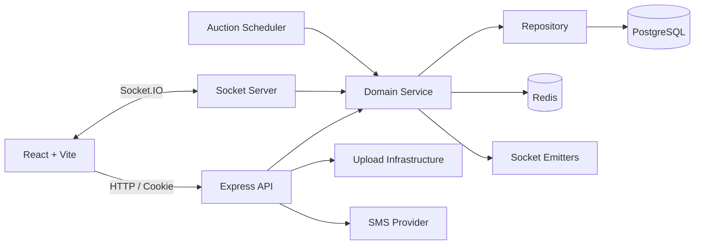

# 아키텍처

## 전체 구성



## 백엔드 계층

| 계층 | 책임 |
|---|---|
| Router | URL, HTTP method, 인증·업로드 middleware 조합 |
| Controller | 요청값 전달, 응답 status와 DTO 반환 |
| Service | 정책·권한·상태 전이·외부 부수효과 순서 |
| Repository | SQL, row lock, transaction 단위 영속화 |
| Infrastructure | PostgreSQL, Redis, Upload, SMS 연결 |
| Socket | 인증, room join/leave, inbound handler, outbound emitter |
| Scheduler | 종료 Timer와 서버 재시작 복구 |

## 의존성 방향

```text
Router → Controller → Service → Repository → Infrastructure
Socket Handler ────────┘
Scheduler ─────────────┘
```

Repository는 Socket이나 Redis를 호출하지 않는다. DB commit 이후의 Redis·Socket·파일 정리는 Service가 수행한다.

## 프런트엔드 구조

```text
router
→ page
→ reusable component / hook
→ domain API client
→ common http client
→ backend

AuthContext → SocketContext → NotificationContext
```

- 서버 데이터는 `useRemote`가 loading/data/error/reload 상태를 관리한다.
- 인증이 확정된 뒤 Socket을 연결한다.
- 알림은 서버가 내려주는 `targetPath`를 우선 사용한다.
- 경매 상세와 목록은 현재 보이는 경매 room에 join하고 갱신 이벤트를 반영한다.
