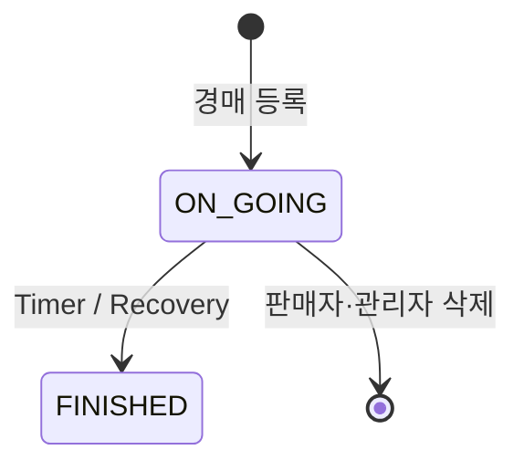
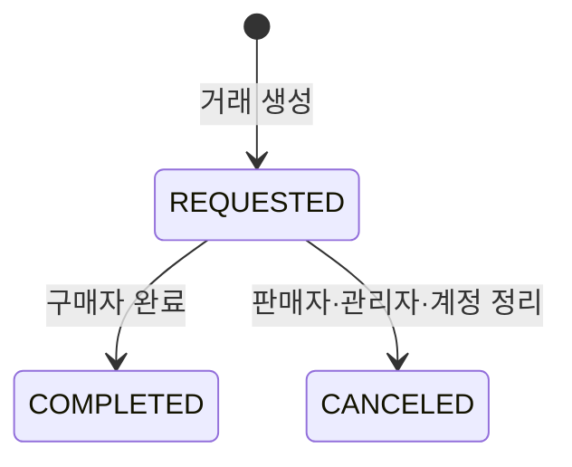

# 도메인과 데이터

## 주요 DB 상태

| 구분 | 값 |
|---|---|
| `user_role` | `USER`, `ADMIN` |
| `listing_type` | `USED`, `AUCTION` |
| `used_trade_status` | `ON_SALE`, `SOLD` |
| `auction_status` | `ON_GOING`, `FINISHED` |
| `transaction_status` | `REQUESTED`, `COMPLETED`, `CANCELED` |
| `chat_message_type` | `TEXT`, `IMAGE`, `SYSTEM`, `PAYMENT_REQUEST`, `TRADE_COMPLETE` |

후기 평점은 DB와 API 모두 1~10 정수다. 후기 태그 테이블과 API는 사용하지 않는다.

## 핵심 상태 전이

## Redis 키

| 키 | 값 | 목적 |
|---|---|---|
| `session:sub:{sid}` | Refresh session JSON | Rotation·로그아웃·재사용 탐지 |
| `phone:{purpose}:{phone}:code` | 인증번호 hash/metadata | 전화 인증 TTL |
| `phone:{purpose}:{phone}:verified:{id}` | 인증 완료 proof | 회원가입·계정 변경 소비 |
| `auction:{listingIdx}:state` | 현재가·입찰 단위·종료 시각·최고 입찰자 | 상세·복구 보조 cache |
| `auction:{listingIdx}:bidders` | `userIdx → bidAmount` sorted set | 사용자별 현재 최고 입찰 |

Redis는 DB의 영속 원본을 대체하지 않는다. Redis 갱신 실패 시 DB 결과는 유지하고 복구 대상으로 기록한다.

## Socket room

| Room | 대상 |
|---|---|
| `user:{userIdx}` | 개인 알림, 낙찰, 추월, 채팅방 목록 갱신 |
| `chat:{chatRoomIdx}` | 새 메시지와 읽음 처리 |
| `auction:{listingIdx}` | 현재가, 최고 입찰자, 종료, 삭제 |

## 알림 이동 정책

| 알림 | 이동 대상 |
|---|---|
| 새 채팅방·새 메시지 | `/chat/:chatRoomIdx` |
| 송금 요청·완료·취소 | `/payment/:transactionIdx` |
| 낙찰 | 생성된 `/payment/:transactionIdx` |
| 추월·경매 종료 | `/auction/:listingIdx` |
| 삭제된 경매 | 이동 없이 삭제 안내, 또는 참여 내역 |
