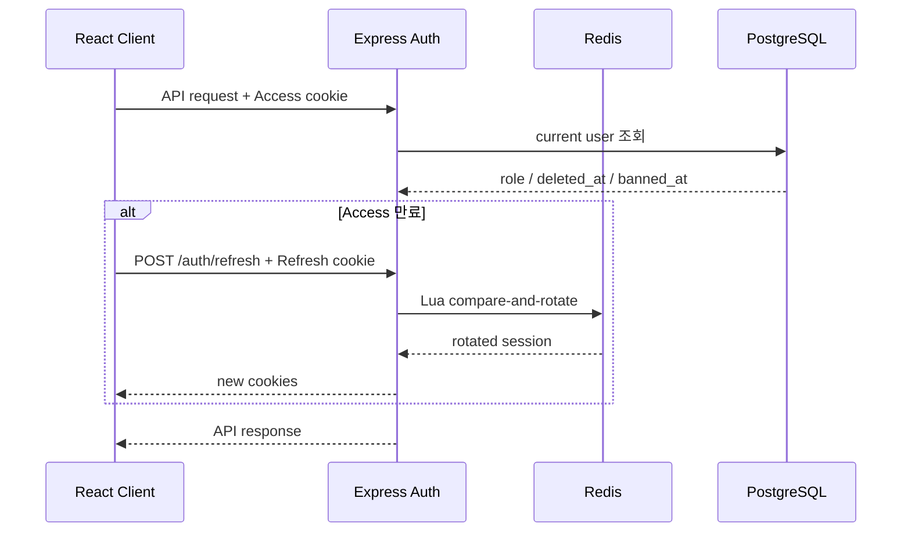
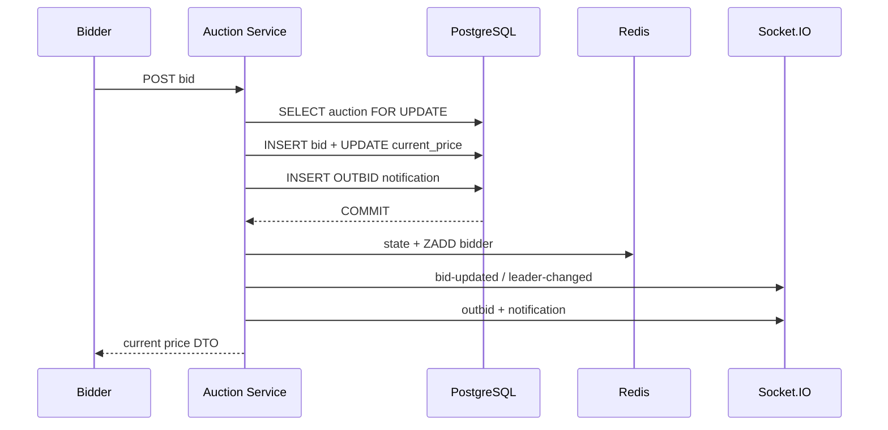

# 다이어그램

## 인증과 API 요청



## 입찰



## 낙찰

```mermaid
activityDiagram
  start
  :경매 행 잠금;
  if (이미 종료?) then (예)
    :멱등 반환;
    stop
  endif
  :최고 유효 입찰자 조회;
  if (낙찰자 있음?) then (예)
    :거래 생성;
    :판매자-낙찰자 채팅방 생성/재사용;
    :SYSTEM 메시지와 알림 저장;
  else (아니오)
    :판매자 무입찰 종료 알림 저장;
  endif
  :DB commit;
  :Timer/Redis 정리;
  :Socket 이벤트 전송;
  stop
```
