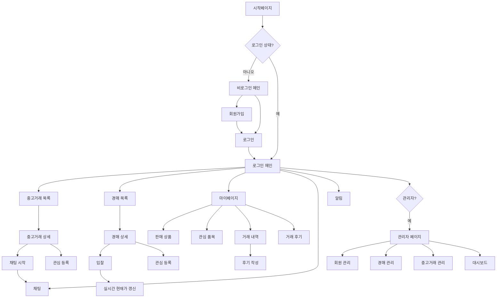

# 전체 사용자 플로우

```mermaid
flowchart TD
    A[시작페이지] --> B{로그인 상태?}
    B -- 아니오 --> C[비로그인 메인]
    B -- 예 --> D[로그인 메인]

    C --> E[회원가입]
    C --> F[로그인]
    F --> D
    E --> F

    D --> G[중고거래 목록]
    D --> H[경매 목록]
    D --> I[마이페이지]
    D --> J[채팅]
    D --> K[알림]

    G --> L[중고거래 상세]
    L --> M[채팅 시작]
    M --> J
    L --> N[관심 등록]

    H --> O[경매 상세]
    O --> P[입찰]
    P --> Q[실시간 현재가 갱신]
    O --> R[관심 등록]

    I --> S[판매 상품]
    I --> T[관심 품목]
    I --> U[거래 내역]
    I --> V[거래 후기]
    U --> W[후기 작성]

    D --> X{관리자?}
    X -- 예 --> Y[관리자 페이지]
    Y --> Z[회원 관리]
    Y --> AA[경매 관리]
    Y --> AB[중고거래 관리]
    Y --> AC[대시보드]
```

## 구현 체크리스트

- [ ] 비로그인/로그인 메인 분기
- [ ] 중고거래 목록에서 상세 이동
- [ ] 경매 목록에서 상세 이동
- [ ] 상세에서 관심 등록
- [ ] 상세에서 채팅 시작
- [ ] 마이페이지 탭 이동
- [ ] 관리자 권한 분기
