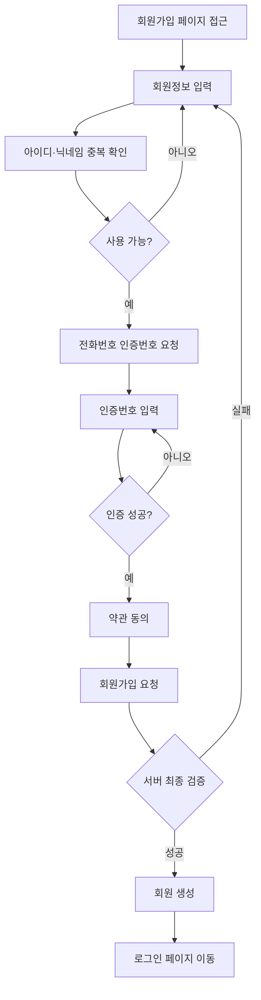

```mermaid

flowchart TD
    A[회원가입 페이지 접근] --> B[회원정보 입력]
    B --> C[아이디·닉네임 중복 확인]
    C --> D{사용 가능?}

    D -- 아니오 --> B
    D -- 예 --> E[전화번호 인증번호 요청]

    E --> F[인증번호 입력]
    F --> G{인증 성공?}

    G -- 아니오 --> F
    G -- 예 --> H[약관 동의]
    H --> I[회원가입 요청]

    I --> J{서버 최종 검증}
    J -- 실패 --> B
    J -- 성공 --> K[회원 생성]

    K --> L[로그인 페이지 이동]
    
```

