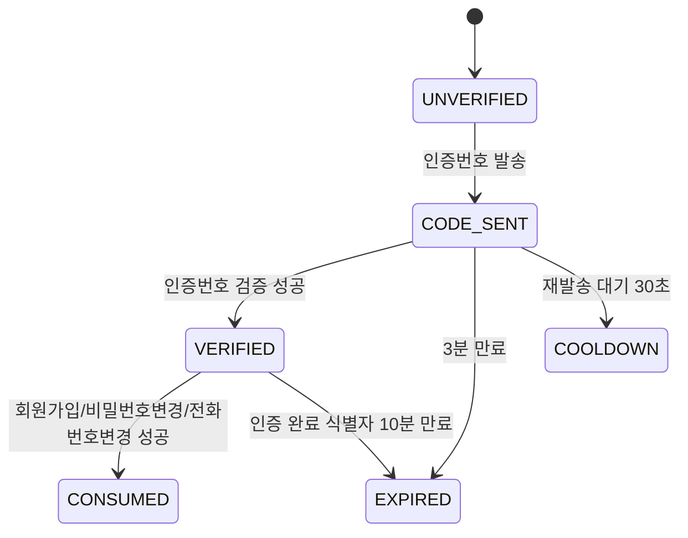
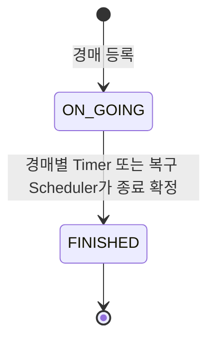
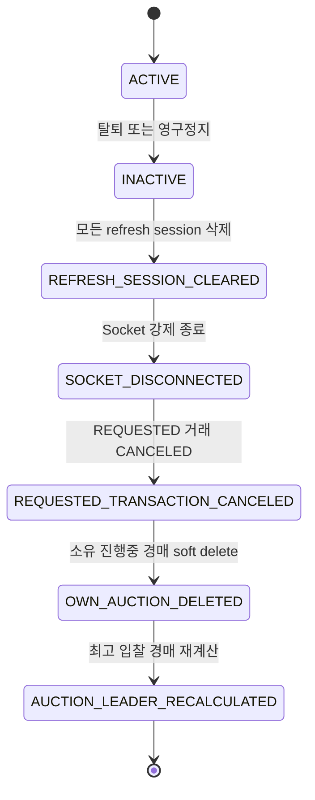

# 도메인 상태 목록

> 상태는 화면 표시, API 검증, Socket 이벤트, 관리자 처리의 기준이 된다.

## 1. 사용자 상태

| 상태 | DB 기준 | 의미 | 주요 제한 |
|---|---|---|---|
| 정상 | `deleted_at IS NULL` AND `banned_at IS NULL` | 일반 사용자 | 제한 없음 |
| 탈퇴 | `deleted_at IS NOT NULL` | 사용자가 자진 탈퇴 | 로그인/토큰 재발급/Socket/보호 API/신규 행동 차단 |
| 영구정지 | `banned_at IS NOT NULL` | 관리자가 영구정지 | 로그인/토큰 재발급/Socket/글작성/입찰/채팅/송금 요청 차단 |

`banned_until`은 DB에 유지하지만 MVP에서는 사용하지 않는다.
일반 사용자 화면에서는 탈퇴/영구정지 사용자의 닉네임을 `삭제된 사용자`로 표시하고 프로필 이동을 비활성화한다.

## 2. 게시글 삭제 상태

중고글과 경매글은 공통 `listings`의 삭제 컬럼으로 삭제 상태를 판단한다.

| 상태 | DB 기준 | 의미 | 화면 노출 |
|---|---|---|---|
| 정상 게시글 | `listings.deleted_at IS NULL` | 조회 가능한 게시글 | 목록/검색/상세/마이페이지 노출 |
| 삭제 게시글 | `listings.deleted_at IS NOT NULL` | 사용자 또는 관리자가 삭제 | 일반 사용자 화면에서 미노출, 상세 직접 접근 시 404 |

삭제는 물리 삭제가 아니다. 연결된 입찰, 거래, 채팅, 후기 이력은 보존한다.
삭제 시 `favorites` 행은 삭제한다. 완료 거래내역에서는 과거 상품 정보만 보여주고 상세 이동은 비활성화한다.

## 3. 중고거래 상태

| 상태 | DB enum | 의미 | 허용 동작 |
|---|---|---|---|
| 판매중 | `ON_SALE` | 거래 가능 | 조회, 관심, 채팅, 송금 요청 |
| 판매완료 | `SOLD` | 거래 완료 | 조회, 후기 작성 |

중고글 취소 상태는 사용하지 않는다. 삭제는 `listings.deleted_at`으로 판단한다.

## 4. 경매 상태

| 상태 | DB enum | 의미 | 허용 동작 |
|---|---|---|---|
| 진행중 | `ON_GOING` | 입찰 가능 | 조회, 관심, 입찰, 채팅, 실시간 현재가 수신 |
| 종료 | `FINISHED` | 경매 종료 확정 | 조회, 관심, 낙찰 결과 확인 |

경매 취소 상태는 사용하지 않는다. 삭제는 `listings.deleted_at`으로 판단한다.

## 5. 거래 상태

| 상태 | DB enum | 의미 |
|---|---|---|
| 요청됨 | `REQUESTED` | 판매자가 송금 요청을 생성 |
| 완료 | `COMPLETED` | 구매자가 송금하여 거래 완료 |
| 취소 | `CANCELED` | 판매자가 송금 요청을 취소 |

`CANCELED`는 게시글/경매 취소가 아니라 송금 요청 취소다.

## 6. 채팅 메시지 타입

| 타입 | 의미 |
|---|---|
| `TEXT` | 일반 텍스트 |
| `IMAGE` | 이미지 메시지 |
| `SYSTEM` | 시스템 안내 |
| `PAYMENT_REQUEST` | 송금 요청 링크 메시지 |
| `TRADE_COMPLETE` | 거래 완료 안내 |

## 7. 알림 타입

| 타입 | referenceType | referenceIdx / 이동 대상 | 생성 조건·수신자 |
|---|---|---|---|
| `NEW_CHAT_ROOM` | `CHAT_ROOM` | chat room / 채팅방 | 방 생성 시 상대 참여자 |
| `NEW_MESSAGE` | `CHAT_MESSAGE` | message / 해당 채팅방 | 새 메시지 수신자. 수신자가 방을 보는 중이면 row 생략 |
| `PAYMENT_REQUESTED` | `TRANSACTION` | transaction / 거래 채팅 | 송금 요청 생성 시 구매자 |
| `PAYMENT_RECEIVED` | `TRANSACTION` | transaction / 거래내역 | 송금 완료 시 판매자 |
| `PAYMENT_CANCELED` | `TRANSACTION` | transaction / 거래내역·채팅 | 실제 `REQUESTED -> CANCELED` 시 활성 상대방. 요청이 없으면 생성하지 않음 |
| `NEW_REVIEW` | `REVIEW` | review / 후기 | 후기 작성 시 피후기자 |
| `NEW_BID` | `AUCTION` | listing / 경매 상세 | 새 입찰 시 판매자 |
| `OUTBID` | `AUCTION` | listing / 경매 상세 | 새 최고가로 밀린 이전 최고 입찰자 |
| `AUCTION_WON` | `AUCTION` | listing / 경매 상세 | 종료 시 낙찰자 |
| `AUCTION_ENDED` | `AUCTION` | listing / 경매 상세 | 입찰이 있는 경매 종료 시 판매자 |
| `AUCTION_ENDED_WITHOUT_BID` | `AUCTION` | listing / 경매 상세 | 입찰 없는 경매 종료 시 판매자 |
| `AUCTION_LEADER_CHANGED` | `AUCTION` | listing / 경매 상세 | 최고 입찰자 비활성화 후 선정된 새 최고 입찰자 |
| `LISTING_DELETED` | `LISTING` | listing / 삭제 안내 | 진행 경매 삭제 시 기존 입찰자(사용자당 1건) |

`referenceType`은 링크 종류, `notificationType`은 발생 이벤트를 나타낸다. `AUCTION`의 `referenceIdx`는 별도 auction PK가 아니라 공통 `listings.idx`다.

## 8. 전화번호 인증 상태

## 9. 경매 상태 흐름

삭제는 경매 상태 전이가 아니라 `listings.deleted_at` 기록이다.

## 10. 사용자 비활성화 처리 흐름

## 11. 구현 체크리스트

- [ ] 모든 보호 API에서 탈퇴/정지 사용자 접근 차단
- [ ] 삭제 게시글 일반 사용자 조회 차단 및 상세 404 반환
- [ ] 삭제 시 favorites 행 삭제
- [ ] 중고거래 상태별 버튼 활성화 정책 적용
- [ ] 경매 진행/종료 상태별 버튼 활성화 정책 적용
- [ ] 거래 요청 `REQUESTED/COMPLETED/CANCELED` 처리
- [ ] 사용자 비활성화 시 REQUESTED 거래 CANCELED 처리
- [ ] 사용자 비활성화 시 소유 진행중 경매 삭제
- [ ] 사용자 비활성화 시 최고 입찰자 재계산
- [ ] 알림 타입별 이동 대상 매핑
- [ ] 전화번호 인증 Redis TTL 적용
- [ ] 경매별 Timer와 복구 Scheduler 중복 종료 방지
