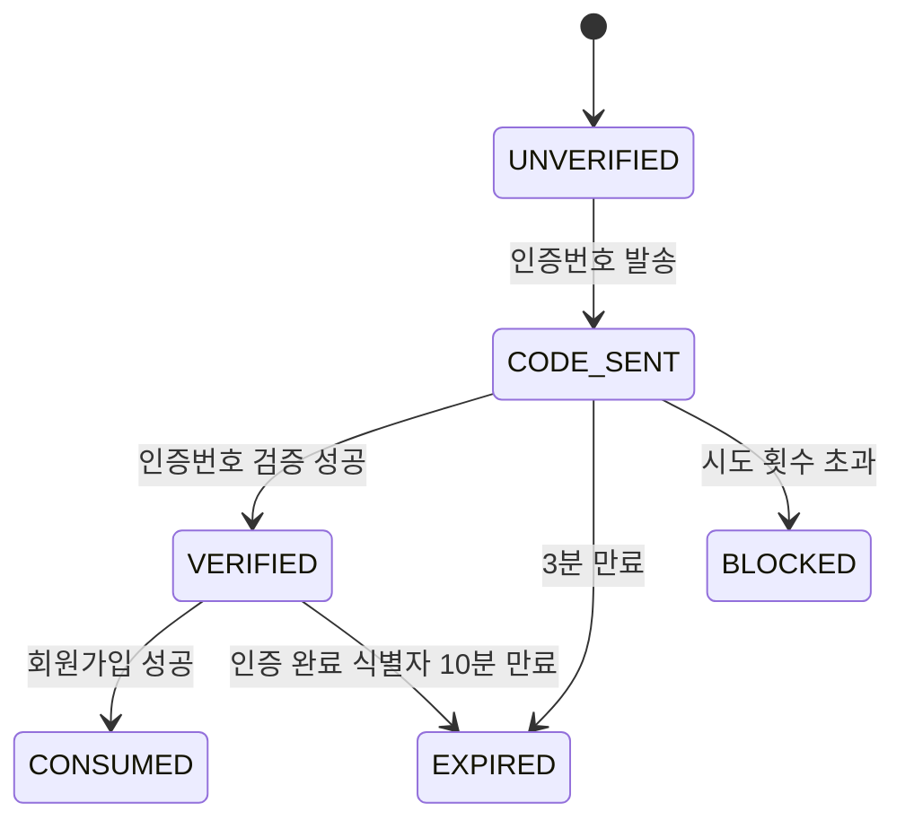
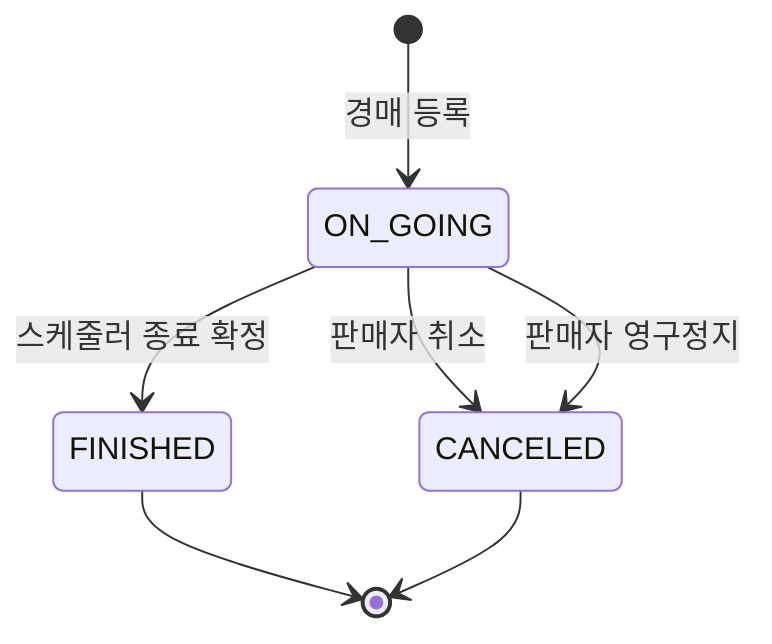

# 도메인 상태 목록

> 상태는 화면 표시, API 검증, Socket 이벤트, 관리자 처리의 기준이 된다.

## 1. 사용자 상태

| 상태   | DB 기준                                              | 의미         | 주요 제한                   |
| ---- | -------------------------------------------------- | ---------- | ----------------------- |
| 정상   | `deleted_at IS NULL` AND `banned_at IS NULL`       | 일반 사용자     | 제한 없음                   |
| 탈퇴   | `deleted_at IS NOT NULL`                           | 사용자가 자진 탈퇴 | 로그인/토큰 재발급 차단           |
| 영구정지 | `banned_at IS NOT NULL` AND `banned_until IS NULL` | 관리자가 영구정지  | 로그인/토큰 재발급/글작성/입찰/채팅 차단 |

## 2. 중고거래 상태

| 상태 | DB enum | 의미 | 허용 동작 |
|---|---|---|---|
| 판매중 | `ON_SALE` | 거래 가능 | 조회, 관심, 채팅, 거래 요청 |
| 판매취소 | `CANCELED` | 판매자가 취소 | 조회 가능 여부는 화면 정책에 따름, 거래 불가 |
| 판매완료 | `SOLD` | 거래 완료 | 후기 작성 가능 |

## 3. 경매 상태

| 상태 | DB enum | 의미 | 허용 동작 |
|---|---|---|---|
| 진행중 | `ON_GOING` | 입찰 가능 | 조회, 관심, 입찰, 실시간 현재가 수신 |
| 종료 | `FINISHED` | 스케줄러가 종료 확정 | 낙찰 결과 조회, 알림, 거래 진행 |
| 취소 | `CANCELED` | 판매자 취소 또는 관리자 정책에 의한 취소 | 입찰/관심/채팅 비활성화 |

## 4. 거래 상태

| 상태 | DB enum | 의미 |
|---|---|---|
| 요청됨 | `REQUESTED` | 거래 또는 송금 요청 생성 |
| 완료 | `COMPLETED` | 거래 완료 |
| 취소 | `CANCELED` | 거래 요청 취소 |

## 5. 채팅 메시지 타입

| 타입 | 의미 |
|---|---|
| `TEXT` | 일반 텍스트 |
| `IMAGE` | 이미지 메시지 |
| `SYSTEM` | 시스템 안내 |
| `PAYMENT_REQUEST` | 송금/거래 요청 |
| `TRADE_COMPLETE` | 거래 완료 안내 |

## 6. 알림 타입

| 타입 | 이동 대상 | 생성 조건 |
|---|---|---|
| `NEW_CHAT_ROOM` | 채팅방 | 새 채팅방 생성 |
| `NEW_MESSAGE` | 채팅방 | 새 메시지 수신 |
| `NEW_BID` | 경매 상세 | 내 경매에 새 입찰 발생 |
| `OUTBID` | 경매 상세 | 내가 최고 입찰자에서 밀림 |
| `AUCTION_WON` | 경매 상세/거래 | 내가 낙찰 |
| `AUCTION_ENDED` | 경매 상세 | 내 경매 종료 |
| `AUCTION_ENDED_WITHOUT_BID` | 경매 상세 | 입찰 없이 경매 종료 |
| `PAYMENT_COMPLETED` | 거래내역 | 결제 또는 송금 완료 |
| `PAYMENT_RECEIVED` | 거래내역 | 판매자가 결제/송금 수신 |
| `NEW_REVIEW` | 후기 | 새 후기 작성 |

## 7. 전화번호 인증 상태

## 8. 경매 상태 흐름

## 9. 구현 체크리스트

- [ ] 모든 보호 API에서 탈퇴/정지 사용자 접근 차단
- [ ] 중고거래 상태별 버튼 활성화 정책 적용
- [ ] 경매 상태별 버튼 활성화 정책 적용
- [ ] 알림 타입별 이동 대상 매핑
- [ ] 전화번호 인증 Redis TTL 적용
- [ ] 경매 종료 스케줄러가 `FINISHED`/`CANCELED` 상태를 중복 처리하지 않도록 구현
