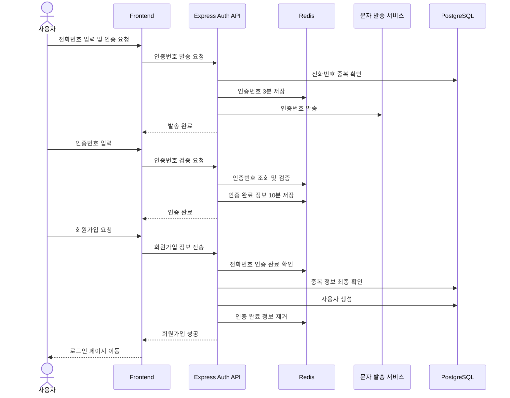

```mermaid
sequenceDiagram
    actor U as 사용자
    participant F as Frontend
    participant A as Express Auth API
    participant R as Redis
    participant S as 문자 발송 서비스
    participant D as PostgreSQL

    U->>F: 전화번호 입력 및 인증 요청
    F->>A: 인증번호 발송 요청
    A->>D: 전화번호 중복 확인
    A->>R: 인증번호 3분 저장
    A->>S: 인증번호 발송
    A-->>F: 발송 완료

    U->>F: 인증번호 입력
    F->>A: 인증번호 검증 요청
    A->>R: 인증번호 조회 및 검증
    A->>R: 인증 완료 정보 10분 저장
    A-->>F: 인증 완료

    U->>F: 회원가입 요청
    F->>A: 회원가입 정보 전송
    A->>R: 전화번호 인증 완료 확인
    A->>D: 중복 정보 최종 확인
    A->>D: 사용자 생성
    A->>R: 인증 완료 정보 제거
    A-->>F: 회원가입 성공

    F-->>U: 로그인 페이지 이동
```