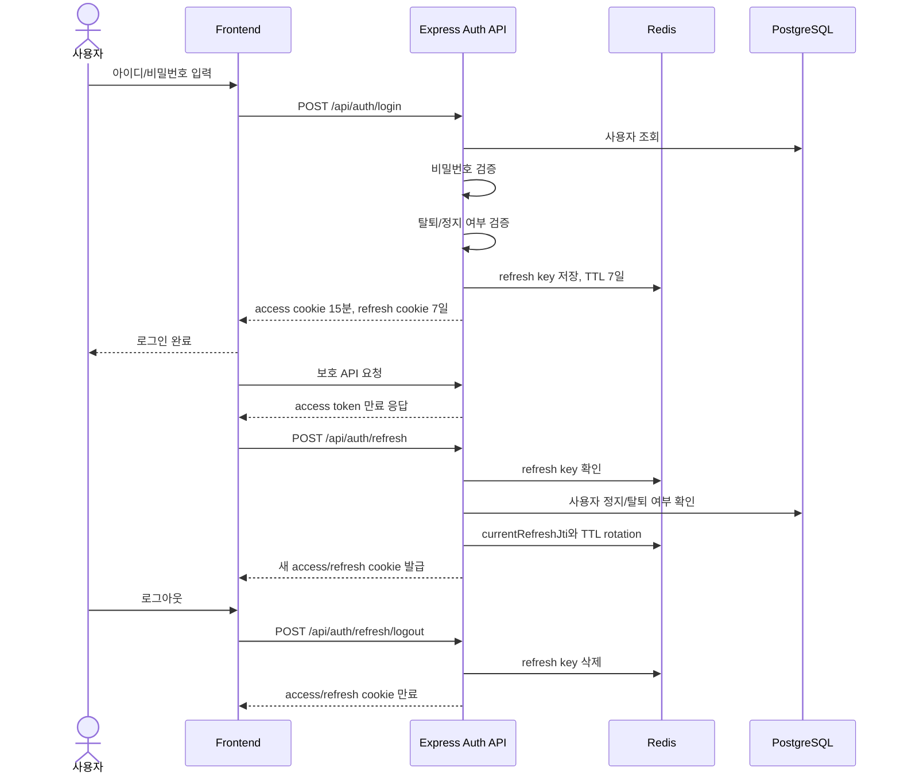

# A-02 로그인 토큰 재발급 시퀀스

```mermaid
sequenceDiagram
    actor U as 사용자
    participant F as Frontend
    participant A as Express Auth API
    participant R as Redis
    participant D as PostgreSQL

    U->>F: 아이디/비밀번호 입력
    F->>A: POST /api/auth/login
    A->>D: 사용자 조회
    A->>A: 비밀번호 검증
    A->>A: 탈퇴/정지 여부 검증
    A->>R: refresh key 저장, TTL 7일
    A-->>F: access cookie 15분, refresh cookie 7일
    F-->>U: 로그인 완료

    F->>A: 보호 API 요청
    A-->>F: access token 만료 응답
    F->>A: POST /api/auth/refresh
    A->>R: refresh key 확인
    A->>D: 사용자 정지/탈퇴 여부 확인
    A->>R: currentRefreshJti와 TTL rotation
    A-->>F: 새 access/refresh cookie 발급

    U->>F: 로그아웃
    F->>A: POST /api/auth/refresh/logout
    A->>R: refresh key 삭제
    A-->>F: access/refresh cookie 만료
```

## 체크리스트

- [ ] 로그인 시 Redis refresh key 저장
- [ ] refresh cookie path 제한
- [ ] access 만료 시 refresh API 호출
- [ ] 로그아웃 시 Redis key 삭제
- [ ] 정지 사용자 재발급 차단
