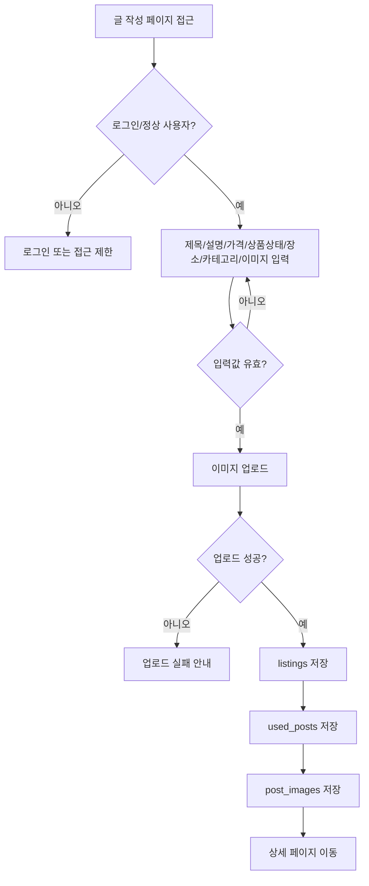

# C-01 중고거래 등록 액티비티

```mermaid
flowchart TD
    A[글 작성 페이지 접근] --> B{로그인/정상 사용자?}
    B -- 아니오 --> C[로그인 또는 접근 제한]
    B -- 예 --> D[제목/설명/가격/상품상태/장소/카테고리/이미지 입력]
    D --> E{입력값 유효?}
    E -- 아니오 --> D
    E -- 예 --> F[이미지 업로드]
    F --> G{업로드 성공?}
    G -- 아니오 --> H[업로드 실패 안내]
    G -- 예 --> I[listings 저장]
    I --> J[used_posts 저장]
    J --> K[post_images 저장]
    K --> L[상세 페이지 이동]
```

## 체크리스트

- [ ] 정지 사용자 차단
- [ ] 가격 0 이상 검증
- [ ] 상품 상태 enum 검증
- [ ] 카테고리 활성 여부 확인
- [ ] listings/used_posts/post_images 저장 순서 처리
