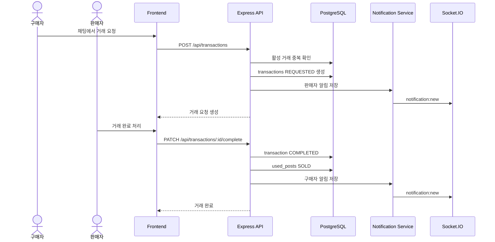

# C-02 중고거래 거래완료 시퀀스

```mermaid
sequenceDiagram
    actor B as 구매자
    actor S as 판매자
    participant F as Frontend
    participant A as Express API
    participant D as PostgreSQL
    participant N as Notification Service
    participant IO as Socket.IO

    B->>F: 채팅에서 거래 요청
    F->>A: POST /api/transactions
    A->>D: 활성 거래 중복 확인
    A->>D: transactions REQUESTED 생성
    A->>N: 판매자 알림 저장
    N->>IO: notification:new
    A-->>F: 거래 요청 생성

    S->>F: 거래 완료 처리
    F->>A: PATCH /api/transactions/:id/complete
    A->>D: transaction COMPLETED
    A->>D: used_posts SOLD
    A->>N: 구매자 알림 저장
    N->>IO: notification:new
    A-->>F: 거래 완료
```

## 체크리스트

- [ ] 활성 거래 중복 방지
- [ ] 판매자/구매자 본인 확인
- [ ] 거래 완료 transaction 처리
- [ ] 판매 상태 SOLD 변경
- [ ] 후기 작성 가능 상태로 노출
