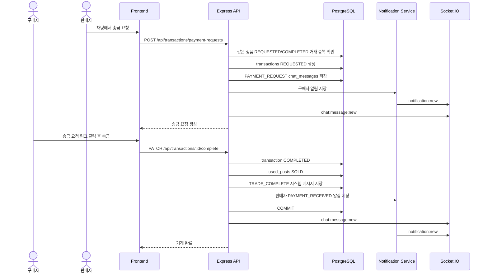

# C-02 중고거래 송금요청 거래완료 시퀀스

## 체크리스트

- [ ] 같은 상품 REQUESTED/COMPLETED 거래 최대 1개 보장
- [ ] 판매자/구매자 본인 확인
- [ ] 거래 완료 transaction 처리
- [ ] 판매 상태 SOLD 변경
- [ ] TRADE_COMPLETE 시스템 메시지 저장
- [ ] PAYMENT_RECEIVED 알림 통일
- [ ] 후기 작성 가능 상태로 노출
