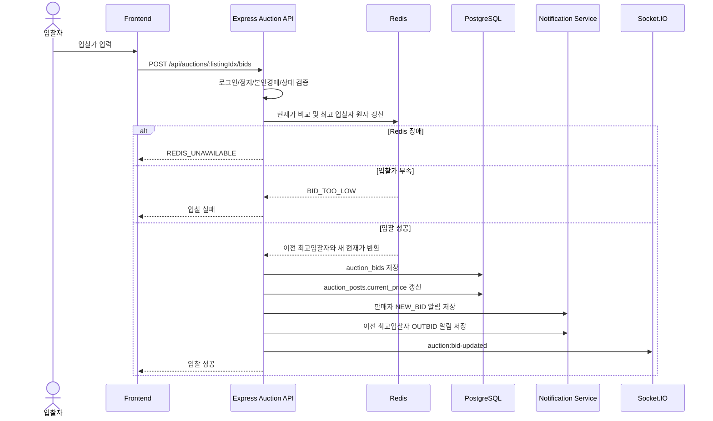

# D-01 경매 입찰 시퀀스

```mermaid
sequenceDiagram
    actor U as 입찰자
    participant F as Frontend
    participant A as Express Auction API
    participant R as Redis
    participant D as PostgreSQL
    participant N as Notification Service
    participant IO as Socket.IO

    U->>F: 입찰가 입력
    F->>A: POST /api/auctions/:listingIdx/bids
    A->>A: 로그인/정지/본인경매/상태 검증
    A->>R: 현재가 비교 및 최고 입찰자 원자 갱신
    alt Redis 장애
        A-->>F: REDIS_UNAVAILABLE
    else 입찰가 부족
        R-->>A: BID_TOO_LOW
        A-->>F: 입찰 실패
    else 입찰 성공
        R-->>A: 이전 최고입찰자와 새 현재가 반환
        A->>D: auction_bids 저장
        A->>D: auction_posts.current_price 갱신
        A->>N: 판매자 NEW_BID 알림 저장
        A->>N: 이전 최고입찰자 OUTBID 알림 저장
        A->>IO: auction:bid-updated
        A-->>F: 입찰 성공
    end
```

## 체크리스트

- [ ] Redis 장애 시 입찰 차단
- [ ] 원자 비교/갱신 처리
- [ ] DB 저장 실패 처리 정책 결정
- [ ] 이전 최고입찰자 알림
- [ ] 경매방 Socket emit
