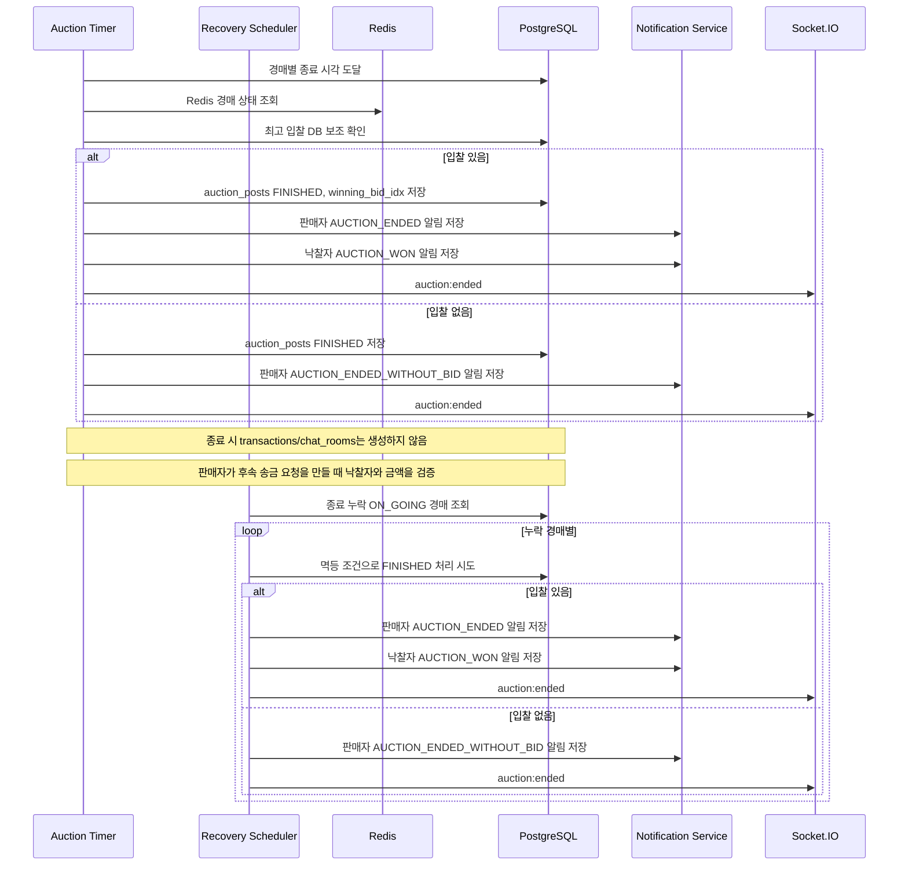

# D-02 경매 종료 Timer 복구 시퀀스

## 체크리스트

- [ ] 중복 종료 방지
- [ ] 경매별 Timer 등록
- [ ] 서버 시작 시 Timer 복원
- [ ] 낙찰자 있는 경우 winning_bid_idx 저장
- [ ] 유찰 알림
- [ ] Socket 종료 이벤트
- [ ] Redis 상태 정리
- [ ] 종료 처리와 거래 생성 분리
