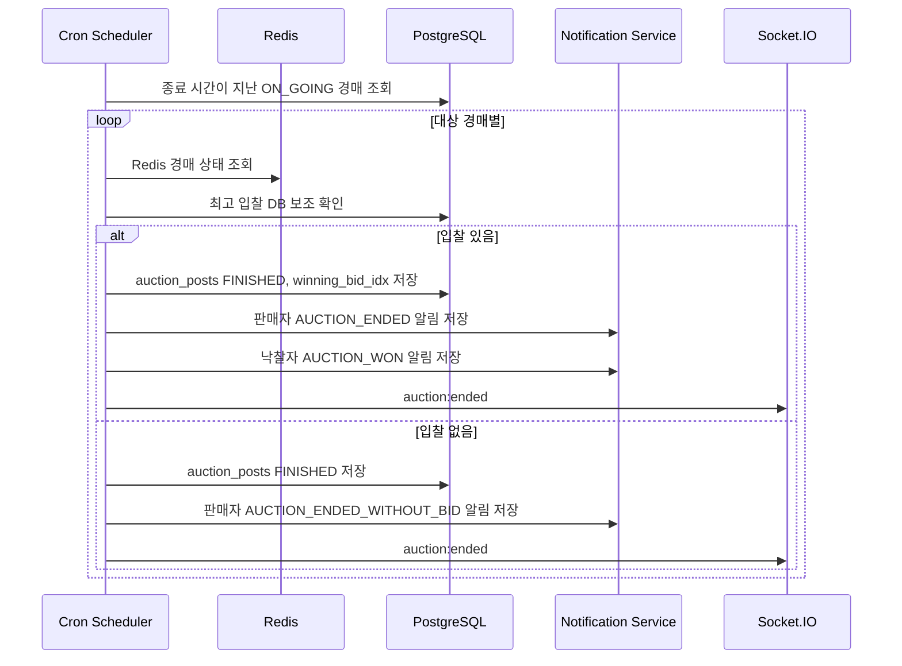

# D-02 경매 종료 스케줄러 시퀀스

```mermaid
sequenceDiagram
    participant C as Cron Scheduler
    participant R as Redis
    participant D as PostgreSQL
    participant N as Notification Service
    participant IO as Socket.IO

    C->>D: 종료 시간이 지난 ON_GOING 경매 조회
    loop 대상 경매별
        C->>R: Redis 경매 상태 조회
        C->>D: 최고 입찰 DB 보조 확인
        alt 입찰 있음
            C->>D: auction_posts FINISHED, winning_bid_idx 저장
            C->>N: 판매자 AUCTION_ENDED 알림 저장
            C->>N: 낙찰자 AUCTION_WON 알림 저장
            C->>IO: auction:ended
        else 입찰 없음
            C->>D: auction_posts FINISHED 저장
            C->>N: 판매자 AUCTION_ENDED_WITHOUT_BID 알림 저장
            C->>IO: auction:ended
        end
    end
```

## 체크리스트

- [ ] 중복 종료 방지
- [ ] 낙찰자 있는 경우 winning_bid_idx 저장
- [ ] 유찰 알림
- [ ] Socket 종료 이벤트
- [ ] Redis 상태 정리
