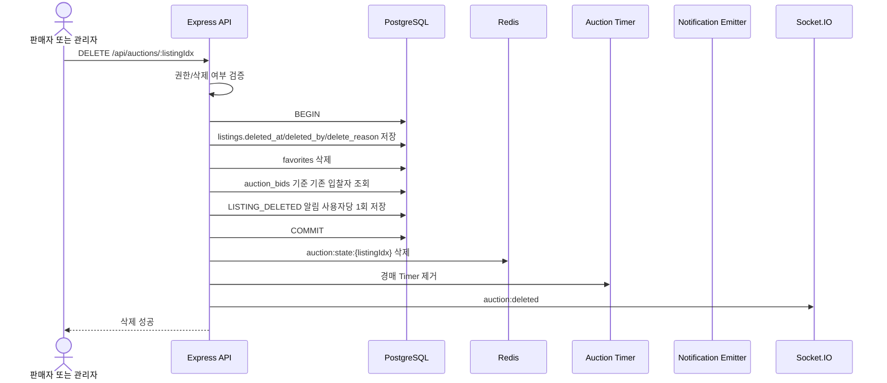

# D-03 경매 삭제 시퀀스

## 체크리스트

- [ ] soft delete
- [ ] favorites 삭제
- [ ] 입찰 기록 보존
- [ ] 알림 대상은 DB `auction_bids`에서 조회
- [ ] LISTING_DELETED 알림 중복 방지
- [ ] Redis 상태 삭제
- [ ] Timer 제거
- [ ] auction:deleted emit
