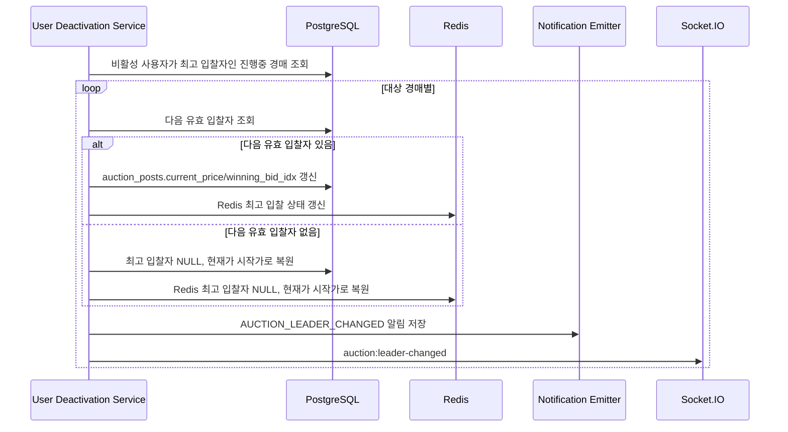

# D-04 최고 입찰자 재계산 시퀀스

## 체크리스트

- [ ] 탈퇴/정지 사용자 제외
- [ ] 기존 입찰 기록 보존
- [ ] 다음 유효 입찰자 조회
- [ ] 후보 없음 처리
- [ ] Redis 상태 갱신
- [ ] 내부 제재 사유 비노출
- [ ] AUCTION_LEADER_CHANGED 알림
- [ ] auction:leader-changed emit
