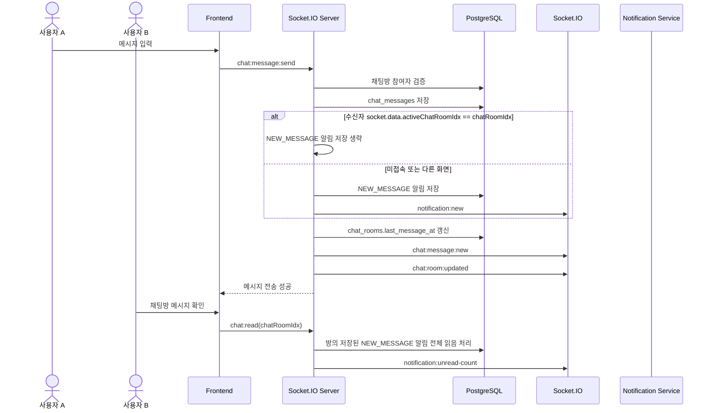

# E-01 채팅 알림 시퀀스

## 체크리스트

- [ ] 채팅방 참여자 검증
- [ ] Socket command 검증
- [ ] 메시지 DB 저장
- [ ] last_message_at 갱신
- [ ] `socket.data.activeChatRoomIdx` 기준 NEW_MESSAGE 저장 생략
- [ ] 미접속/다른 화면 수신자 NEW_MESSAGE 저장
- [ ] chat:read 읽음 처리
