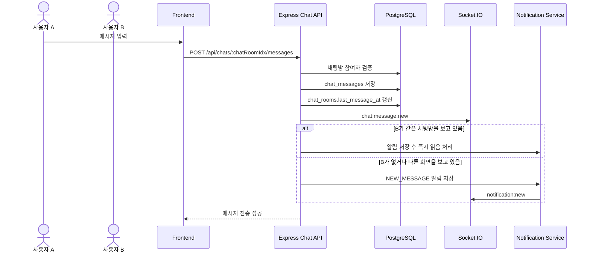

# E-01 채팅 알림 시퀀스

```mermaid
sequenceDiagram
    actor A as 사용자 A
    actor B as 사용자 B
    participant F as Frontend
    participant API as Express Chat API
    participant D as PostgreSQL
    participant IO as Socket.IO
    participant N as Notification Service

    A->>F: 메시지 입력
    F->>API: POST /api/chats/:chatRoomIdx/messages
    API->>D: 채팅방 참여자 검증
    API->>D: chat_messages 저장
    API->>D: chat_rooms.last_message_at 갱신
    API->>IO: chat:message:new
    alt B가 같은 채팅방을 보고 있음
        API->>N: 알림 저장 후 즉시 읽음 처리
    else B가 없거나 다른 화면을 보고 있음
        API->>N: NEW_MESSAGE 알림 저장
        N->>IO: notification:new
    end
    API-->>F: 메시지 전송 성공
```

## 체크리스트

- [ ] 채팅방 참여자 검증
- [ ] 메시지 DB 저장
- [ ] last_message_at 갱신
- [ ] 같은 방 접속 여부 판단
- [ ] 알림 저장/읽음 처리
