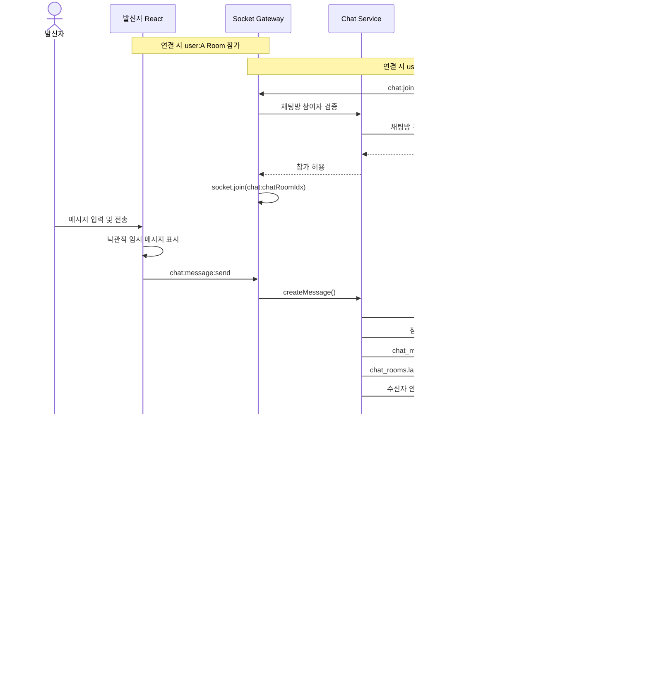

```mermaid
sequenceDiagram
    actor A as 발신자
    participant FA as 발신자 React
    participant S as Socket Gateway
    participant C as Chat Service
    participant DB as PostgreSQL
    participant FB as 수신자 React

    Note over FA,S: 연결 시 user:A Room 참가
    Note over FB,S: 연결 시 user:B Room 참가

    FB->>S: chat:join(chatRoomIdx)
    S->>C: 채팅방 참여자 검증
    C->>DB: 채팅방 구매자·판매자 조회
    DB-->>C: 참여자 정보
    C-->>S: 참가 허용
    S->>S: socket.join(chat:chatRoomIdx)

    A->>FA: 메시지 입력 및 전송
    FA->>FA: 낙관적 임시 메시지 표시
    FA->>S: chat:message:send
    S->>C: createMessage()

    C->>DB: BEGIN
    C->>DB: 참여자 재검증
    C->>DB: chat_messages INSERT
    C->>DB: chat_rooms.last_message_at UPDATE
    C->>DB: 수신자 안읽음 상태 UPDATE
    C->>DB: COMMIT
    DB-->>C: 저장된 메시지

    C-->>S: 메시지 및 목록 갱신 정보
    S-->>FA: ACK 성공 + 실제 messageIdx
    S-->>FB: chat:message:new
    S-->>FB: chat:room:updated
    S-->>FA: chat:room:updated

    FB->>S: chat:read(lastMessageIdx)
    S->>C: markAsRead()
    C->>DB: 마지막 읽은 메시지 갱신
    DB-->>C: 읽음 처리 완료
    S-->>FB: chat:room:updated(unread=0)
    S-->>FA: chat:read:updated
```
