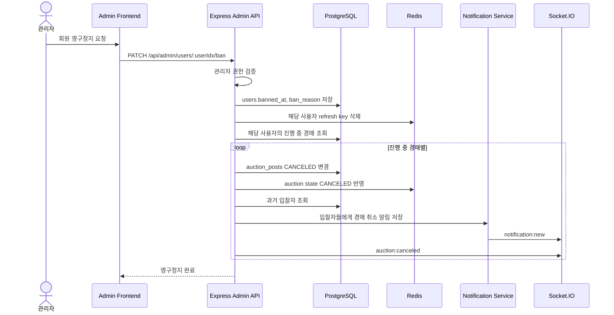

# G-01 관리자 영구정지 경매취소 시퀀스

```mermaid
sequenceDiagram
    actor Admin as 관리자
    participant F as Admin Frontend
    participant A as Express Admin API
    participant D as PostgreSQL
    participant R as Redis
    participant N as Notification Service
    participant IO as Socket.IO

    Admin->>F: 회원 영구정지 요청
    F->>A: PATCH /api/admin/users/:userIdx/ban
    A->>A: 관리자 권한 검증
    A->>D: users.banned_at, ban_reason 저장
    A->>R: 해당 사용자 refresh key 삭제
    A->>D: 해당 사용자의 진행 중 경매 조회
    loop 진행 중 경매별
        A->>D: auction_posts CANCELED 변경
        A->>R: auction state CANCELED 반영
        A->>D: 과거 입찰자 조회
        A->>N: 입찰자들에게 경매 취소 알림 저장
        N->>IO: notification:new
        A->>IO: auction:canceled
    end
    A-->>F: 영구정지 완료
```

## 체크리스트

- [ ] 관리자 권한 검증
- [ ] 정지 사유 저장
- [ ] refresh key 삭제
- [ ] 진행 중 경매 CANCELED 처리
- [ ] 입찰자 알림
- [ ] 정지 사유 일반 사용자 미노출
