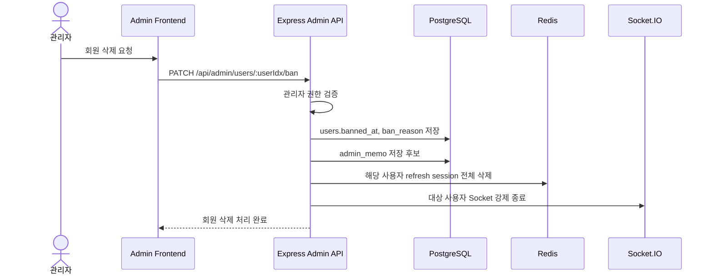

# G-01 관리자 회원 삭제 영구정지 시퀀스

```mermaid
sequenceDiagram
    actor Admin as 관리자
    participant F as Admin Frontend
    participant A as Express Admin API
    participant D as PostgreSQL
    participant R as Redis
    participant IO as Socket.IO

    Admin->>F: 회원 삭제 요청
    F->>A: PATCH /api/admin/users/:userIdx/ban
    A->>A: 관리자 권한 검증
    A->>D: users.banned_at, ban_reason 저장
    A->>D: admin_memo 저장 후보
    A->>R: 해당 사용자 refresh session 전체 삭제
    A->>IO: 대상 사용자 Socket 강제 종료
    A-->>F: 회원 삭제 처리 완료
```

## 체크리스트

- [ ] 관리자 권한 검증
- [ ] 정지 사유 저장
- [ ] refresh session 전체 삭제
- [ ] 대상 사용자 Socket 강제 종료
- [ ] 정지 사유 일반 사용자 미노출
