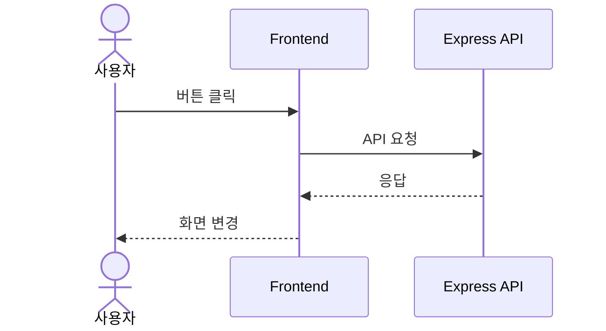
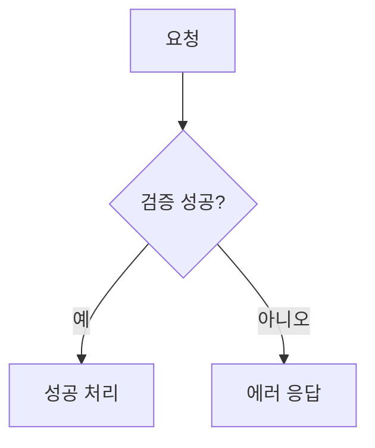

# 다이어그램 읽는 법

> 팀원이 다이어그램에 익숙하지 않아도 구현 흐름을 따라갈 수 있도록 최소 용어를 정리한다.

## 1. Actor

Actor는 시스템 밖에서 행동을 시작하는 대상이다.

- 사용자
- 비회원
- 관리자
- 스케줄러
- 문자 발송 서비스

## 2. Participant

Participant는 흐름에 참여하는 시스템 내부 또는 외부 구성요소다.

- Frontend
- Express API
- Redis
- PostgreSQL
- Socket.IO

## 3. Sequence Diagram

시간 순서대로 누가 누구에게 요청하는지 보여준다.

## 4. Flowchart

조건에 따라 흐름이 어떻게 갈라지는지 보여준다.

## 5. Activity Diagram 대체 표기

Mermaid에서는 activity diagram을 flowchart로 표현한다.

- 사각형: 행동
- 마름모: 조건
- 화살표: 다음 단계
- `예/아니오`: 조건 결과

## 6. 구현할 때 읽는 순서

1. Actor가 누구인지 본다.
2. 어떤 API 또는 Socket 이벤트가 시작점인지 본다.
3. Redis와 DB 중 어느 쪽을 먼저 쓰는지 본다.
4. 실패 조건이 어디서 나오는지 본다.
5. 마지막에 화면이 어떻게 바뀌는지 본다.
