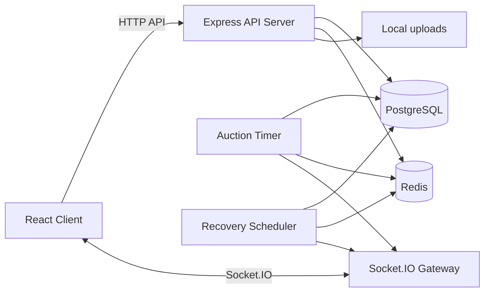
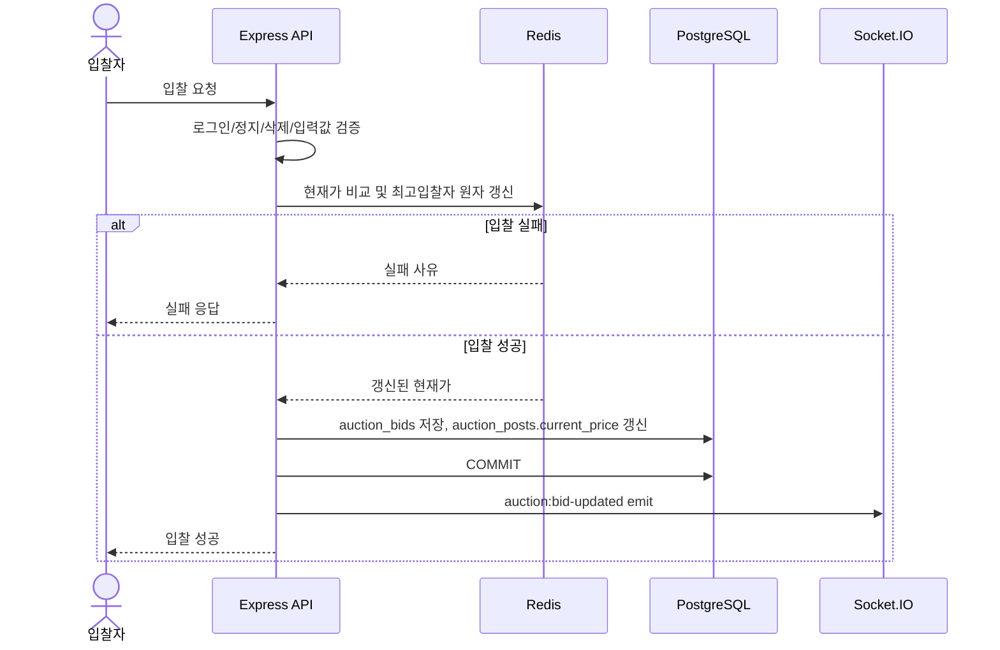
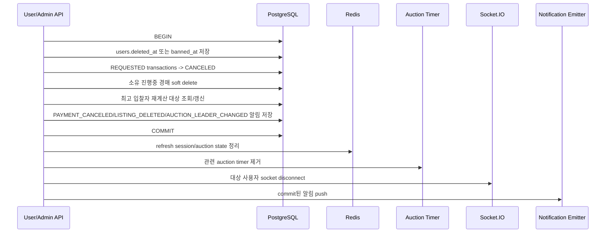

# 전체 서버 아키텍처

## 1. 목표

Express, PostgreSQL, Redis, Socket.IO를 사용해 중고거래와 경매 서비스를 구현한다. MVP는 단일 서버 배포를 기준으로 하되, Redis adapter, S3, Load Balancer로 확장할 수 있는 구조를 남긴다.

## 2. 큰 그림



## 3. 계층 구조

런타임 변수명과 임시 상태 구조는 [[07. 아키텍처/런타임 컨텍스트 상태]]를 기준으로 한다.

| 계층 | 책임 |
|---|---|
| Router | URL, HTTP method, middleware 연결 |
| Controller | 요청/응답 형식 처리 |
| Service | 핵심 비즈니스 규칙과 transaction 처리 |
| Repository | PostgreSQL 쿼리 |
| Redis Service | refresh session, 전화번호 인증 TTL, 경매 현재 입찰 상태 |
| Socket Gateway | 채팅, 경매, 알림 실시간 이벤트 |
| Auction Timer | 경매별 24시간 종료 예약 |
| Recovery Scheduler | 서버 재시작/Timer 누락 시 진행 중 경매 복구 |
| Storage Service | multer local 저장, `/resources` 공개, 향후 S3 교체 |
| Notification Emitter | 알림 DB 저장과 Socket push를 한 곳에서 처리 |
| User Deactivation Service | 탈퇴/영구정지 공통 후속 처리 |

## 4. 추천 폴더 구조

```text
src/
  app.js
  server.js
  config/
    env.js
    db.js
    redis.js
    socket.js
  modules/
    auth/
    users/
    listings/
    used/
    auctions/
    bids/
    chats/
    notifications/
    transactions/
    reviews/
    mypage/
    admin/
  database/
    migrations/
    seeds/
  schedulers/
    auctionTimer.service.js
    auctionRecoveryScheduler.js
  sockets/
    index.js
    socketAuth.js
    chat.socket.js
    auction.socket.js
    notification.socket.js
  emitters/
    notification.emitter.js
  infrastructure/
    storage/
      fileStorage.interface.js
      diskStorage.service.js
      s3Storage.service.js
    sms/
      sms.interface.js
      consoleSms.service.js
      productionSms.service.js
  workers/
    auctionBid.worker.js  # MVP 제외, Redis Stream 확장 항목
  common/
    middlewares/
    errors/
    validators/
    logging/
    utils/
```

## 5. PostgreSQL 책임

- 최종 영속 데이터 저장
- 사용자, 게시글, 중고거래, 경매, 입찰, 거래, 후기, 알림 저장
- 게시글 삭제는 `listings.deleted_at`, `deleted_by`, `delete_reason`으로 처리
- 게시글/경매 삭제 시 해당 `favorites` 행 삭제
- 낙찰 확정과 거래 생성은 transaction으로 처리
- Redis 장애 후 진행 중 경매 상태와 Timer 복원 기준
- 사용자 비활성화 시 REQUESTED 거래 CANCELED 처리
- 사용자 비활성화 시 소유 진행중 경매 soft delete 처리
- 사용자 비활성화 시 최고 입찰자 재계산 처리

## 6. Redis 책임

- Refresh Token session key 저장
- 전화번호 인증번호, cooldown, 인증 완료 상태, 회원가입 전화번호 reservation TTL 관리
- 진행 중 경매 현재 최고 입찰 상태 관리
- Redis 장애 시 신규 입찰은 차단한다.

### 6.1 Refresh Token Redis 예시

```text
session:{sub}:{sid} -> currentRefreshJti, userAgent, ip, createdAt, rotatedAt
TTL: 7 days
```

### 6.2 경매 Redis 예시

```text
auction:state:{listingIdx} -> Redis Hash(currentPrice, highestBidderIdx, highestBidIdx)
```

경매 상태, 시작가, 종료 시간, 입찰자 목록은 PostgreSQL을 기준으로 조회하고 `minNextBid`는 서버에서 계산한다.
진행 중 경매 삭제 알림 대상은 Redis Set이 아니라 `auction_bids`에서 `bidder_idx`를 중복 제거해 조회한다.

## 7. 경매 입찰 처리



## 8. 경매 Timer와 Recovery Scheduler 책임

- 경매 등록 시 기본 24시간 종료 Timer를 등록한다.
- 서버 시작 시 `ON_GOING` 경매를 조회해 남은 시간 기준으로 Timer를 복원한다.
- `listings.deleted_at IS NOT NULL`인 경매는 Timer 복원 대상에서 제외한다.
- 복구용 Scheduler는 Timer 누락 또는 서버 장애로 종료되지 않은 경매를 보조 확인한다.
- 복구용 Scheduler도 삭제된 경매는 제외한다.
- 종료 시 Redis 상태와 DB 입찰 내역을 기준으로 낙찰 여부를 확정한다.
- 낙찰자가 있으면 `FINISHED`, `winning_bid_idx`를 저장한다.
- 낙찰자가 없으면 `FINISHED`로 종료하고 유찰 알림을 만든다.
- 알림은 DB에 먼저 저장하고, 접속 중 사용자에게 Socket으로 전송한다.
- 진행 중 경매 삭제 시 DB COMMIT 이후 Redis 경매 상태 삭제, Timer 제거, `auction:deleted` 전송 순서로 처리한다.

## 8.1 사용자 비활성화 처리 순서



## 9. Socket.IO 책임

- 채팅 텍스트 메시지 command 수신
- 채팅 메시지/채팅방 목록 갱신 이벤트 전송
- 경매 현재가 갱신 전송
- 경매 최고 입찰자 재계산 전송
- 경매 삭제 전송
- 경매 종료/낙찰 이벤트 전송
- 알림 push
- 핵심 상태 변경은 항상 서버 검증과 DB/Redis 처리 후 emit한다.

## 9.1 상태 동기화 계약

| 계층 | 책임 | 하지 않는 일 |
|---|---|---|
| Frontend | 요청 중복 방지, 응답 반영, Socket 중복/역순 무시, 재연결 후 HTTP 재조회 | 화면 상태로 서버 권한 결정 |
| Express Service | 검증 순서와 transaction 경계, Redis/DB 반영, commit 후 emit | Controller 객체에 도메인 상태 저장 |
| PostgreSQL | 사용자·게시글·입찰 이력·거래·메시지·알림의 최종 원본 | 실시간 room 상태 관리 |
| Redis | refresh/전화 인증 임시 상태, 진행 경매 최고 입찰 projection | 큰 도메인 JSON, 입찰 이력, 알림 목록 저장 |
| Socket.IO | commit된 결과와 재조회 신호 전달 | 영속 상태 또는 성공 여부의 최종 기준 |

- 일반 변경은 DB commit 뒤 Redis 정리와 Socket emit을 수행한다.
- 입찰만 Redis 원자 갱신 뒤 DB에 영속화하며 DB commit 전에는 성공 이벤트를 보내지 않는다.
- Redis 성공 후 DB 실패의 Redis 복구·재처리는 이번 구현에서 보장하지 않고 후속 reconciliation/outbox 경계로 남긴다.
- 입찰 Redis Lua는 승인만 직렬화한다. 경매 row lock이나 version 조건이 없는 MVP에서는 동시에 승인된 요청의 DB commit 역전 가능성이 있으며, 경매별 lock·조건부 update·reconciliation 중 하나가 후속 무결성 과제다.
- commit 뒤 Socket 전송 실패로 DB를 rollback하지 않는다. 클라이언트는 HTTP 재조회로 회복한다.
- 과도한 분산 transaction, Redis Stream, 메시지 broker는 실제 확장 필요 전까지 도입하지 않는다.

## 10. Upload 책임

- MVP는 multer로 `uploads/`에 저장한다.
- 공개 URL prefix는 `/resources`를 사용한다.
- DB에는 `image_url`만 저장한다.
- 범용 `/api/uploads/images` API는 두지 않고, 프로필/게시글/채팅 이미지 요청에서 각각 처리한다.
- 향후 S3로 변경할 수 있도록 `storageService.save(file)` 같은 함수로 감싼다.

## 11. 환경변수

```text
# 개발시에 적극적으로 사용하게 될 환경변수 설정 파일

##  ##  ##  ##  ##  ##  ##  ##  ##  ##  ##  ##  ##  ##  ##  ##  ##  ##  ##  ##  

# server
HOST=127.0.0.1
PORT=8080

# client
CLIENT_ORIGIN=http://127.0.0.1:5173

##  ##  ##  ##  ##  ##  ##  ##  ##  ##  ##  ##  ##  ##  ##  ##  ##  ##  ##  ##  

# db
DATABASE_HOST=127.0.0.1
DATABASE_PORT=5432

DATABASE_NAME=potato_land
DATABASE_USER=potato
DATABASE_PASSWORD=1234

##  ##  ##  ##  ##  ##  ##  ##  ##  ##  ##  ##  ##  ##  ##  ##  ##  ##  ##  ##  

# redis
REDIS_HOST=127.0.0.1
REDIS_PORT=6379
REDIS_PASSWORD=1234

##  ##  ##  ##  ##  ##  ##  ##  ##  ##  ##  ##  ##  ##  ##  ##  ##  ##  ##  ##  

# cookie
COOKIE_SECURE=false
COOKIE_HTTP_ONLY=true
COOKIE_SAME_SITE=lax

##  ##  ##  ##  ##  ##  ##  ##  ##  ##  ##  ##  ##  ##  ##  ##  ##  ##  ##  ##  

# jwt
## 15분
ACCESS_TOKEN_EXPIRES_IN_SEC=900
ACCESS_TOKEN_COOKIE_PATH=/
ACCESS_TOKEN_SECRET=64-byte-secret-64-byte-secret-64-byte-secret

## 7일
REFRESH_TOKEN_EXPIRES_IN_SEC=604800
REFRESH_TOKEN_COOKIE_PATH=/api/auth/refresh
REFRESH_TOKEN_SECRET=64-byte-secret-64-byte-secret-64-byte-secret

##  ##  ##  ##  ##  ##  ##  ##  ##  ##  ##  ##  ##  ##  ##  ##  ##  ##  ##  ##  

# SMS
SMS_API_KEY=secret
SMS_API_SECRET=secret
SMS_PHONE_FROM=010-1111-1111
SMS_OWNER_NAME=owner

##  ##  ##  ##  ##  ##  ##  ##  ##  ##  ##  ##  ##  ##  ##  ##  ##  ##  ##  ##  

# bcrypt
BCRYPT_SALT_ROUNDS=10

##  ##  ##  ##  ##  ##  ##  ##  ##  ##  ##  ##  ##  ##  ##  ##  ##  ##  ##  ##  

# recovery scheduler
AUCTION_RECOVERY_CRON=*/5 * * * *

##  ##  ##  ##  ##  ##  ##  ##  ##  ##  ##  ##  ##  ##  ##  ##  ##  ##  ##  ##  

# upload (multer)
UPLOAD_BASE_DIR=uploads
UPLOAD_LISTING_IMG_DIR=listings
UPLOAD_PROFILE_IMG_DIR=profiles
# 5MiB
UPLOAD_MAX_SIZE_BYTES=5242880
```

## 12. 확장 설계

- S3 도입 시 local storage 구현체를 S3 storage 구현체로 교체한다.
- Load Balancer 도입 시 Socket.IO sticky session 또는 Redis adapter를 검토한다.
- 서버가 여러 대가 되면 경매 Timer/Recovery Scheduler 중복 실행 방지를 위해 Redis lock 또는 PostgreSQL advisory lock을 적용한다.
- Redis Stream + Worker를 적용하면 입찰 성공 이벤트 저장과 DB 반영을 분리할 수 있다.
- Redis Stream + Worker는 MVP 구현 범위가 아니라 고도화 항목으로 둔다.
- `database/migrations`는 DB 변경 이력을 팀 전체가 같은 순서로 적용하기 위한 SQL 폴더다.
- `database/seeds`는 카테고리, 관리자 계정 같은 개발 초기 데이터를 넣기 위한 SQL 폴더다.
- `notification.emitter.js`는 알림 저장과 Socket 전송을 서비스마다 중복 구현하지 않기 위한 모듈이다.

## 13. 구현 체크리스트

- [ ] `.env` 기반 설정 분리
- [ ] DB connection pool 구성
- [ ] Redis client 구성
- [ ] cookie 기반 JWT middleware 구성
- [ ] Socket 인증 middleware 구성
- [ ] 경매별 Timer 구성
- [ ] 경매 복구 Scheduler 구성
- [ ] 알림 저장 후 Socket push 구조 구현
- [ ] notification emitter 분리
- [ ] 사용자 비활성화 공통 서비스 구현
- [ ] 경매 삭제 Redis/Timer 정리
- [ ] 최고 입찰자 재계산 처리
- [ ] multer local upload와 `/resources` 정적 제공 구현
- [ ] Redis 장애 시 입찰 차단 처리
- [ ] 배포 환경에서 Secure cookie 적용
