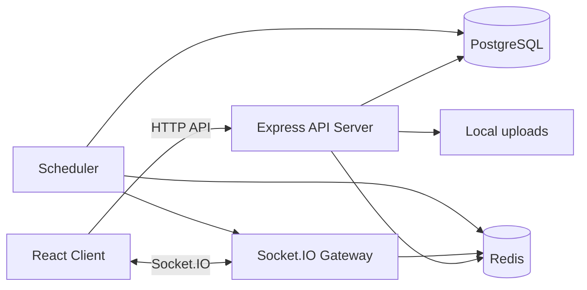
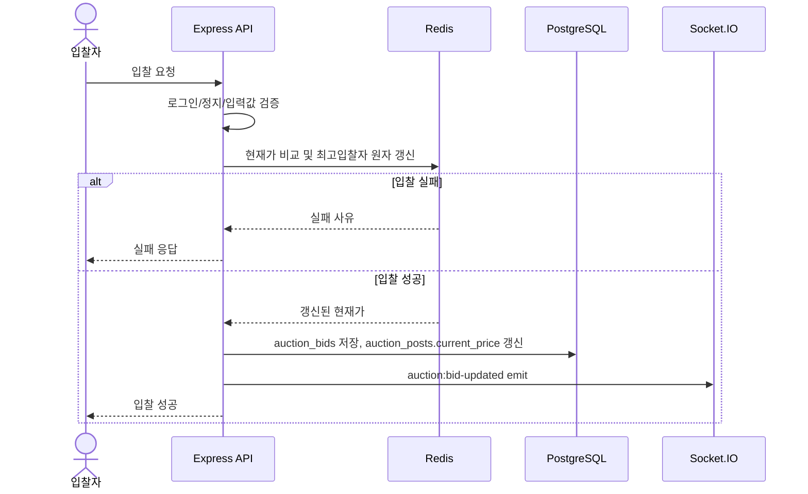

# 전체 서버 아키텍처

## 1. 목표

Express, PostgreSQL, Redis, Socket.IO를 사용해 중고거래와 경매 서비스를 구현한다. MVP는 단일 서버 배포를 기준으로 하되, Redis adapter, S3, Load Balancer로 확장할 수 있는 구조를 남긴다.

## 2. 큰 그림



## 3. 계층 구조

| 계층 | 책임 |
|---|---|
| Router | URL, HTTP method, middleware 연결 |
| Controller | 요청/응답 형식 처리 |
| Service | 핵심 비즈니스 규칙 처리 |
| Repository | PostgreSQL 쿼리 |
| Redis Service | 인증 TTL, 경매 현재가, Socket 보조 상태 |
| Socket Gateway | 채팅, 경매, 알림 실시간 이벤트 |
| Scheduler | 경매 종료, 낙찰 확정, 취소 알림 |
| Storage Service | multer local 저장, 향후 S3 교체 |

## 4. 추천 폴더 구조

```text
src/
  app.js
  server.js
  config/
    env.js
    db.js
    redis.js
    socket.js
  modules/
    auth/
    users/
    listings/
    used/
    auctions/
    bids/
    chats/
    notifications/
    mypage/
    admin/
    uploads/
  schedulers/
    auctionCloseScheduler.js
  sockets/
    socketAuth.js
    chat.socket.js
    auction.socket.js
    notification.socket.js
  common/
    middlewares/
    errors/
    utils/
```

## 5. PostgreSQL 책임

- 최종 영속 데이터 저장
- 사용자, 게시글, 중고거래, 경매, 입찰, 거래, 후기, 알림 저장
- 낙찰 확정과 거래 생성은 transaction으로 처리
- Redis 장애 후 진행 중 경매 상태 복원 기준

## 6. Redis 책임

- Refresh Token 유효성 key 저장
- 전화번호 인증번호와 인증 완료 식별자 TTL 관리
- 진행 중 경매 현재 최고 입찰 상태 관리
- Socket.IO 접속 사용자 상태 보조
- Redis 장애 시 신규 입찰은 차단한다.

### 6.1 Refresh Token Redis 예시

```text
refresh:{userIdx}:{tokenId} -> hashedRefreshToken
TTL: 7 days
```

### 6.2 경매 Redis 예시

```text
auction:{listingIdx}:state -> currentPrice, highestBidderIdx, highestBidId, endsAt, status
auction:{listingIdx}:participants -> bidder user idx set
```

## 7. 경매 입찰 처리



## 8. Scheduler 책임

- 주기적으로 종료 시간이 지난 `ON_GOING` 경매를 조회한다.
- Redis 상태와 DB 입찰 내역을 기준으로 낙찰 여부를 확정한다.
- 낙찰자가 있으면 `FINISHED`, `winning_bid_idx`를 저장한다.
- 낙찰자가 없으면 `FINISHED`로 종료하고 유찰 알림을 만든다.
- 취소 대상이면 `CANCELED`로 변경한다.
- 알림은 DB에 먼저 저장하고, 접속 중 사용자에게 Socket으로 전송한다.

## 9. Socket.IO 책임

- 채팅 메시지 실시간 전송
- 경매 현재가 갱신 전송
- 경매 종료/취소/낙찰 이벤트 전송
- 알림 push
- 핵심 상태 변경은 항상 서버 검증과 DB/Redis 처리 후 emit한다.

## 10. Upload 책임

- MVP는 multer로 `/uploads`에 저장한다.
- DB에는 `image_url`만 저장한다.
- 향후 S3로 변경할 수 있도록 `storageService.save(file)` 같은 함수로 감싼다.

## 11. 환경변수 후보

```text
NODE_ENV=
PORT=
CLIENT_ORIGIN=
DATABASE_URL=
REDIS_URL=
JWT_ACCESS_SECRET=
JWT_REFRESH_SECRET=
ACCESS_TOKEN_TTL=15m
REFRESH_TOKEN_TTL=7d
COOKIE_SECURE=
UPLOAD_DIR=uploads
STATIC_UPLOAD_PATH=/uploads
AUCTION_CLOSE_CRON=* * * * *
```

## 12. 확장 설계

- S3 도입 시 local storage 구현체를 S3 storage 구현체로 교체한다.
- Load Balancer 도입 시 Socket.IO sticky session 또는 Redis adapter를 검토한다.
- 서버가 여러 대가 되면 Scheduler 중복 실행 방지를 위해 Redis lock 또는 PostgreSQL advisory lock을 적용한다.
- Redis Stream + Worker를 적용하면 입찰 성공 이벤트 저장과 DB 반영을 분리할 수 있다.

## 13. 구현 체크리스트

- [ ] `.env` 기반 설정 분리
- [ ] DB connection pool 구성
- [ ] Redis client 구성
- [ ] cookie 기반 JWT middleware 구성
- [ ] Socket 인증 middleware 구성
- [ ] 경매 스케줄러 구성
- [ ] 알림 저장 후 Socket push 구조 구현
- [ ] multer local upload 구현
- [ ] Redis 장애 시 입찰 차단 처리
- [ ] 배포 환경에서 Secure cookie 적용
