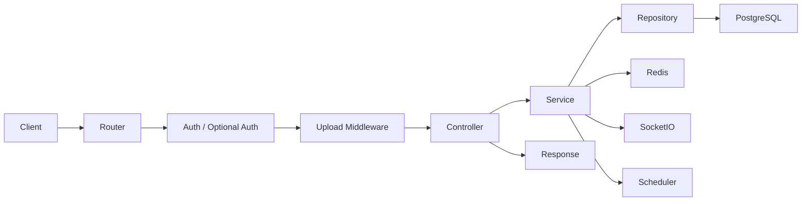

# 서버 요청 처리 구조

## 1. 전체 흐름

1. Express가 요청을 받는다.
2. 공개·필수 인증 정책에 따라 사용자를 확인한다.
3. 파일과 입력값을 검증한다.
4. Controller가 HTTP 입력을 Service 입력으로 변환한다.
5. Service가 권한, 상태 전이, transaction 경계를 결정한다.
6. Repository가 SQL만 실행한다.
7. DB commit 이후 Redis, Socket, 파일 정리, 알림 전파를 수행한다.
8. Controller가 공통 응답 형식으로 반환한다.

## 2. 계층 책임

### Router

- URL과 HTTP method를 선언한다.
- `requireAuth`, `optionalAuth`, `requireRole`을 배치한다.
- 공통 upload middleware를 배치한다.
- 비즈니스 판단을 하지 않는다.

### Controller

- `req.params`, `req.query`, `req.body`, `req.files`, `req.user`를 읽는다.
- Service를 호출한다.
- status code와 response envelope만 결정한다.
- SQL과 Redis key를 직접 다루지 않는다.

### Service

- 사용자 권한과 도메인 상태를 확인한다.
- 여러 Repository 호출을 조합한다.
- transaction 범위와 commit 이후 부수효과 순서를 결정한다.
- DTO를 만든다.

### Repository

- PostgreSQL SQL과 row 반환만 담당한다.
- HTTP 객체와 Socket 객체를 받지 않는다.
- Redis를 호출하지 않는다.

### Infrastructure

- `infrastructure/database/database.js`: Pool, query, transaction
- `infrastructure/redis/redisClient.js`: Redis 연결
- `infrastructure/uploads/upload.js`: Multer 설정과 public URL
- `infrastructure/sms/*`: SMS provider

도메인 내부에 `env/db.js`, 별도 Redis client, 별도 Multer storage를 만들지 않는다.
