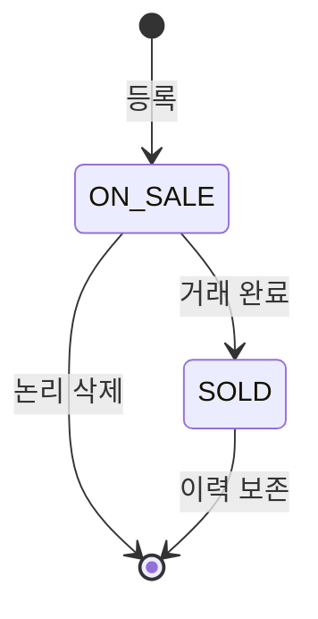
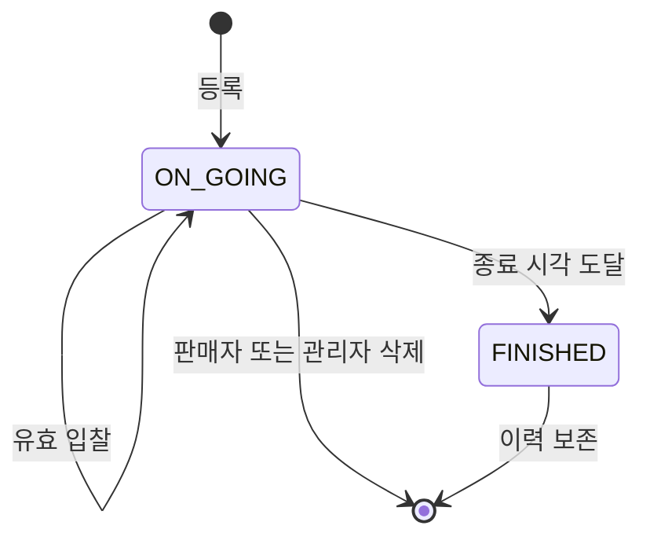
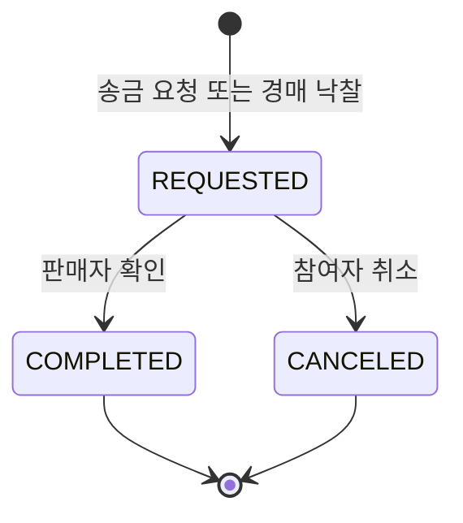

# 도메인 상태 전이

## 1. 중고거래

`RESERVED`는 최종 DB enum과 API에서 사용하지 않는다.

## 2. 경매

종료 처리 순서:

1. 경매 row를 lock하고 아직 `ON_GOING`인지 확인한다.
2. 최고 입찰을 선정한다.
3. `auction_posts.status=FINISHED`, `winning_bid_idx`를 저장한다.
4. 낙찰자가 있으면 `transactions(type=AUCTION, status=REQUESTED)`을 생성한다.
5. DB commit 후 Timer·Redis state를 제거한다.
6. 판매자·낙찰자·입찰자에게 알림과 Socket event를 보낸다.

## 3. 거래

완료 시 중고 상품은 `SOLD`가 된다. 경매 상품은 이미 `FINISHED` 상태를 유지한다.

## 4. 사용자

- 활성: `deleted_at IS NULL AND banned_at IS NULL`
- 정지: `banned_at IS NOT NULL`
- 탈퇴: `deleted_at IS NOT NULL`

정지·탈퇴 시 진행 거래, 소유 상품, 경매 입찰 선두, session을 일관되게 정리한다.
