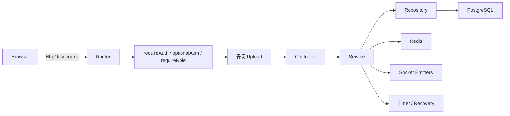
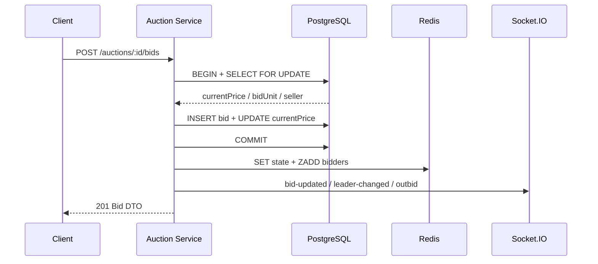
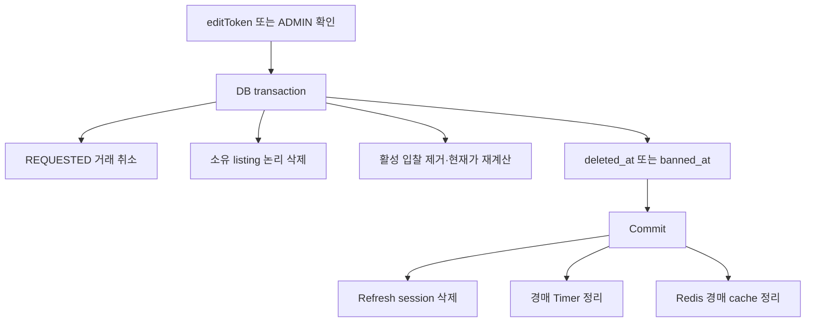

# 최종 아키텍처 다이어그램

## HTTP

```mermaid
flowchart LR
  Browser -->|HttpOnly cookie| Router
  Router --> Auth[requireAuth / optionalAuth / requireRole]
  Auth --> Upload[공통 Upload]
  Upload --> Controller
  Controller --> Service
  Service --> Repository
  Repository --> PostgreSQL
  Service --> Redis
  Service --> Emitters[Socket Emitters]
  Service --> Timer[Timer / Recovery]
```

## 경매 일관성

```mermaid
sequenceDiagram
  participant C as Client
  participant S as Auction Service
  participant P as PostgreSQL
  participant R as Redis
  participant IO as Socket.IO
  C->>S: POST /auctions/:id/bids
  S->>P: BEGIN + SELECT FOR UPDATE
  P-->>S: currentPrice / bidUnit / seller
  S->>P: INSERT bid + UPDATE currentPrice
  S->>P: COMMIT
  S->>R: SET state + ZADD bidders
  S->>IO: bid-updated / leader-changed / outbid
  S-->>C: 201 Bid DTO
```

## 회원 탈퇴·정지

```mermaid
flowchart TD
  Verify[editToken 또는 ADMIN 확인] --> Tx[DB transaction]
  Tx --> Cancel[REQUESTED 거래 취소]
  Tx --> Listings[소유 listing 논리 삭제]
  Tx --> Bids[활성 입찰 제거·현재가 재계산]
  Tx --> User[deleted_at 또는 banned_at]
  User --> Commit
  Commit --> Sessions[Refresh session 삭제]
  Commit --> Timers[경매 Timer 정리]
  Commit --> Cache[Redis 경매 cache 정리]
```
